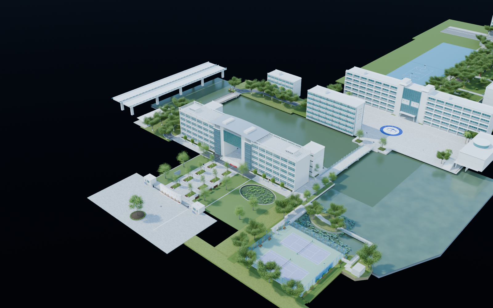

# 温州中学三维复刻项目

用户授权助手负责项目；先完成素材读取验收，再推进建模。

## 当前状态

全景图片读取验收已通过：95个点位、570个完整全景面、46,926张最高分辨率原始切片全部保存并解码，无缺片。
2个航拍点位每面5760×5760，其他93个点位每面4352×4352。

严格1:1所需的实际尺寸、标高与未拍摄区域仍须核验。
已制作南大门样板，以及沿南门广场—德涵楼/贯真楼—跨水桥—步青广场—中山路中段/北段—北门的连续外景初版，并接入食堂外景。保留网球场、道司前路、荷屿和水南路四个南侧场景；东侧文化区本批先加入图书馆外景，以及有素材的一、二层大厅、中庭和可见楼梯。各版待用户验收，完整校园尚未建成。
目标已确认：可自由行走的写实校园，兼顾航拍与地面细节。
当前用Blender组织可编辑外景资产；UE漫游集成和运行时碰撞、性能验收尚未开始。
2026-09-06：Blender MCP场景读取和脚本执行通过，版本5.1.2；当前会话尚未发现UE MCP工具。

## 版本与交付

仓库：[cocomilk23/3D_WZMS](https://github.com/cocomilk23/3D_WZMS)。

- [阶段交付计划](docs/交付计划.md)
- [v0.0.1项目基线](deliverables/v0.0.1/交付说明.md)
- [v0.0.2南大门样板](deliverables/v0.0.2/交付说明.md)
- [v0.0.3网页预览](deliverables/v0.0.3/交付说明.md) · [本机打开](http://127.0.0.1:8766/)（需启动本地服务）
- [v0.0.4南大门广场](deliverables/v0.0.4/交付说明.md) · [广场工程](models/campus/WZMS_Campus_v004.blend)
- [v0.0.5德涵楼、贯真楼外景](deliverables/v0.0.5/交付说明.md) · [楼体与广场工程](models/campus/WZMS_Campus_v005.blend)
- [v0.0.6中山路南段与跨水桥](deliverables/v0.0.6/交付说明.md) · [南侧整合工程](models/campus/WZMS_Campus_v006.blend)
- [v0.0.7步青广场](deliverables/v0.0.7/交付说明.md) · [步青广场整合工程](models/campus/WZMS_Campus_v007.blend)
- [v0.0.8中山路中段](deliverables/v0.0.8/交付说明.md) · [中段整合工程](models/campus/WZMS_Campus_v008.blend)
- [v0.0.9中山路北段](deliverables/v0.0.9/交付说明.md) · [北段整合工程](models/campus/WZMS_Campus_v009.blend)
- [v0.0.10食堂外景](deliverables/v0.0.10/交付说明.md) · [食堂整合工程](models/campus/WZMS_Campus_v010.blend)
- [v0.0.11北门与南北路线整合](deliverables/v0.0.11/交付说明.md) · [北门整合工程](models/campus/WZMS_Campus_v011.blend)
- [v0.0.12网球场](deliverables/v0.0.12/交付说明.md) · [网球场整合工程](models/campus/WZMS_Campus_v012.blend)
- [v0.0.13道司前路](deliverables/v0.0.13/交付说明.md) · [道司前路整合工程](models/campus/WZMS_Campus_v013.blend)
- [v0.0.14荷屿](deliverables/v0.0.14/交付说明.md) · [荷屿整合工程](models/campus/WZMS_Campus_v014.blend)
- [v0.0.15水南路与南侧四场景整合](deliverables/v0.0.15/交付说明.md) · [南侧整合工程](models/campus/WZMS_Campus_v015.blend)
- [v0.0.16整合网页预览](deliverables/v0.0.16/交付说明.md) · **[打开当前网页预览](http://127.0.0.1:8766/)**（本机服务）
- [v0.0.17图书馆外景](deliverables/v0.0.17/README.md) · [图书馆外景工程](models/campus/WZMS_Campus_v017.blend)
- [v0.0.18图书馆大厅与中庭](deliverables/v0.0.18/README.md) · [图书馆内外景整合工程](models/campus/WZMS_Campus_v018.blend)
- [v0.0.19数学馆外景](deliverables/v0.0.19/README.md) · **[最新整合Blender工程](models/campus/WZMS_Campus_v019.blend)**
- [Blender样板模型](models/south_gate/WZMS_SouthGate_v002.blend)（Git LFS，含打包的墙面参考图）

首版校名和浮雕采用原照片表面细节，尚非独立雕刻网格；尺寸仍为估算，尚未导入UE。

每个可检查工作单元提交并推送，阶段完成后建立标签。模型资产使用Git LFS。
**全量高清全景素材库仍保存在原工作机；新克隆需要另行获取素材包才能使用完整图库。最新工程内已打包南门正反面和中山路牌所用的三张原图，查看已制作场景不需要另找这些贴图。**

## 入口

- [素材图库](reference/素材浏览.html)：搜索95个点位，打开全分辨率参考面。
- [最新验收报告](reference/reports/素材验收报告.md)：本次读取结果与建模资料缺口。
- [逐点目录](reference/reports/scene_inventory.csv)：名称、分类、来源、哈希与状态。
- `reference/panoramas/tiles/`：原始切片ZIP。
- `reference/panoramas/faces/`：拼接参考面与各点位核验记录。
- `reference/source/`：原始页面、配置与用户截图。

## 后续工作

2026-09-07 最新安排：继续图书馆、数学馆、九山路和校史馆，逐场景 Git 管理；本批不更新网页。现有网页仍为 v0.0.16，展示 v0.0.15 校园。文化区建模依据与估计范围见[东侧文化区建模依据](docs/东侧文化区建模依据.md)。

步青广场至北门五个场景保留 v0.0.7–v0.0.11 交付记录。本批次网球场、道司前路、荷屿和水南路分别保留 v0.0.12–v0.0.15 外景初版，待用户验收；不更新网页预览。后续两侧片区顺序见[从南大门向北的制作顺序](docs/南北向制作顺序.md)。照片依据及估算边界见[南侧建模依据](docs/南侧三场景建模依据.md)、[步青广场至北门依据](docs/步青广场至北门建模依据.md)和[南侧四场景依据](docs/南侧四场景建模依据.md)。[用户反馈](docs/用户反馈与待调整.md)中的南门背面校歌问题按要求保留原状。

1. 按建筑制作覆盖与细节清单，区分可见、有依据推断、完全未知区域。
2. 建立尺度和坐标依据，保留误差；视角角度不能充当测量坐标。
3. 在已贯通的主线基础上，逐场景补齐两侧建筑、道路、水系与运动场。
4. 对应95个点位设置模型相机，对比轮廓、门窗、屋顶和材质。

原始全景：https://www.720yun.com/t/a3akiwphz2w?scene_id=119232347

## 核验脚本

运行 `scripts/verify_panoramas.py --sheets` 检查本地切片并生成预览。
运行 `scripts/build_reference_browser.py` 更新本地图库。
运行 `scripts/finalize_reference_audit.py` 在95个点位全部通过解码后更新报告。
初始清点脚本 `build_reference_inventory.py` 会重建早期状态；若重新运行，须再执行核验及最终报告脚本。
