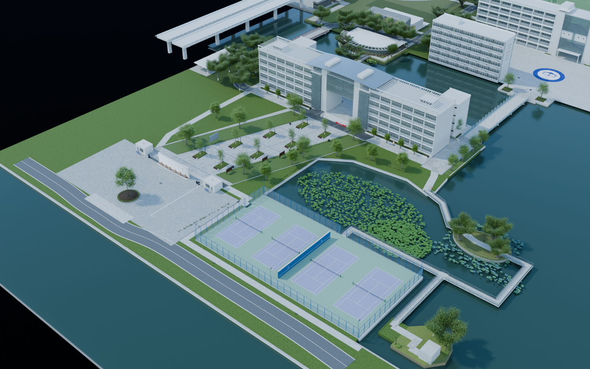

# 温州中学三维复刻项目

用户授权助手负责项目；先完成素材读取验收，再推进建模。

## 当前状态

全景图片读取验收已通过：95个点位、570个完整全景面、46,926张最高分辨率原始切片全部保存并解码，无缺片。
2个航拍点位每面5760×5760，其他93个点位每面4352×4352。

用户已接受按照片估算尺寸，当前布局继续作为制作基础；未拍摄区域和估算性质仍如实记录。
已制作南大门样板，以及沿南门广场—德涵楼/贯真楼—跨水桥—步青广场—中山路中段/北段—北门的连续外景初版，并接入食堂外景。保留网球场、道司前路、荷屿和水南路四个南侧场景，以及图书馆外景与有素材的一、二层大厅、中庭和可见楼梯、数学馆外景、九山路与两座桥、校史馆外景。另有桃花岛、梅花岛艺术楼外景、橘岛、江口路与竹屿连接段，以及榕屿、籀园学堂外景与入口、校友风采门厅和南田路。最新一批补入西门、操场与蓝白看台、体育馆外景、篮球场和西侧运动区整合。各版待用户验收，完整校园尚未建成。
本批 v034—v039 修正两类球场，并补入体育馆、数学馆、校史馆和食堂可见室内的可编辑初版。未知房间和未拍摄楼层不计入完成范围。
v040 完成现有本部内外景的构件与材质深化。v041 根据用户补充的地面图和航拍纠正 v040 的网球场方向判断：四块场地沿教学楼方向排开、长边朝向楼体，隔墙分隔两组场地；荷屿位置和步道重新协调，详见本版说明。
v042 以现有教学楼为参照，按航拍重新安排南门、广场、网球场、荷塘、荷屿与水南路小建筑，重接岸线和步道。位置仍为图像估算，未达到实测 1:1 校准。
目标已确认：可自由行走的写实校园，兼顾航拍与地面细节。
当前用 Blender 组织可编辑内外景资产；v043 增加环境精修，并准备全校园分区 FBX、照片和材质迁移清单。UE 内材质重建、漫游、碰撞与性能验收尚未开始。
2026-09-06：Blender MCP场景读取和脚本执行通过，版本5.1.2；当前会话尚未发现UE MCP工具。

## 版本与交付

仓库：[cocomilk23/3D_WZMS](https://github.com/cocomilk23/3D_WZMS)。

- **[最新 v0.0.43 环境精修与 UE 导入准备](deliverables/v0.0.43/README.md)** · **[校园主工程](models/campus/WZMS_Campus_v043.blend)**
- [UE 导入交接说明](docs/UE导入准备_v043.md) · [v0.0.42 南侧布局校正](deliverables/v0.0.42/README.md)
- [v0.0.41 网球场方向校正](deliverables/v0.0.41/README.md) · [v041 工程](models/campus/WZMS_Campus_v041.blend)

- [阶段交付计划](docs/交付计划.md)
- [v0.0.1项目基线](deliverables/v0.0.1/交付说明.md)
- [v0.0.2南大门样板](deliverables/v0.0.2/交付说明.md)
- [v0.0.3网页预览](deliverables/v0.0.3/交付说明.md) · [本机打开](http://127.0.0.1:8766/)（需启动本地服务）
- [v0.0.4南大门广场](deliverables/v0.0.4/交付说明.md) · [广场工程](models/campus/WZMS_Campus_v004.blend)
- [v0.0.5德涵楼、贯真楼外景](deliverables/v0.0.5/交付说明.md) · [楼体与广场工程](models/campus/WZMS_Campus_v005.blend)
- [v0.0.6中山路南段与跨水桥](deliverables/v0.0.6/交付说明.md) · [南侧整合工程](models/campus/WZMS_Campus_v006.blend)
- [v0.0.7步青广场](deliverables/v0.0.7/交付说明.md) · [步青广场整合工程](models/campus/WZMS_Campus_v007.blend)
- [v0.0.8中山路中段](deliverables/v0.0.8/交付说明.md) · [中段整合工程](models/campus/WZMS_Campus_v008.blend)
- [v0.0.9中山路北段](deliverables/v0.0.9/交付说明.md) · [北段整合工程](models/campus/WZMS_Campus_v009.blend)
- [v0.0.10食堂外景](deliverables/v0.0.10/交付说明.md) · [食堂整合工程](models/campus/WZMS_Campus_v010.blend)
- [v0.0.11北门与南北路线整合](deliverables/v0.0.11/交付说明.md) · [北门整合工程](models/campus/WZMS_Campus_v011.blend)
- [v0.0.12网球场](deliverables/v0.0.12/交付说明.md) · [网球场整合工程](models/campus/WZMS_Campus_v012.blend)
- [v0.0.13道司前路](deliverables/v0.0.13/交付说明.md) · [道司前路整合工程](models/campus/WZMS_Campus_v013.blend)
- [v0.0.14荷屿](deliverables/v0.0.14/交付说明.md) · [荷屿整合工程](models/campus/WZMS_Campus_v014.blend)
- [v0.0.15水南路与南侧四场景整合](deliverables/v0.0.15/交付说明.md) · [南侧整合工程](models/campus/WZMS_Campus_v015.blend)
- [v0.0.16整合网页预览](deliverables/v0.0.16/交付说明.md) · **[打开当前网页预览](http://127.0.0.1:8766/)**（本机服务）
- [v0.0.17图书馆外景](deliverables/v0.0.17/README.md) · [图书馆外景工程](models/campus/WZMS_Campus_v017.blend)
- [v0.0.18图书馆大厅与中庭](deliverables/v0.0.18/README.md) · [图书馆内外景整合工程](models/campus/WZMS_Campus_v018.blend)
- [v0.0.19数学馆外景](deliverables/v0.0.19/README.md) · [数学馆整合工程](models/campus/WZMS_Campus_v019.blend)
- [v0.0.20九山路](deliverables/v0.0.20/README.md) · [九山路整合工程](models/campus/WZMS_Campus_v020.blend)
- [v0.0.21校史馆外景与文化区整合](deliverables/v0.0.21/README.md) · [文化区整合工程](models/campus/WZMS_Campus_v021.blend)
- [v0.0.22桃花岛](deliverables/v0.0.22/README.md) · [桃花岛整合工程](models/campus/WZMS_Campus_v022.blend)
- [v0.0.23梅花岛与艺术楼外景](deliverables/v0.0.23/README.md) · [梅花岛整合工程](models/campus/WZMS_Campus_v023.blend)
- [v0.0.24橘岛](deliverables/v0.0.24/README.md) · [橘岛整合工程](models/campus/WZMS_Campus_v024.blend)
- [v0.0.25江口路、竹屿与岛屿批次整合](deliverables/v0.0.25/README.md) · [岛屿批次工程](models/campus/WZMS_Campus_v025.blend)
- [v0.0.26榕屿](deliverables/v0.0.26/README.md) · [榕屿工程](models/campus/WZMS_Campus_v026.blend)
- [v0.0.27籀园学堂外景与入口](deliverables/v0.0.27/README.md) · [学堂工程](models/campus/WZMS_Campus_v027.blend)
- [v0.0.28校友风采门厅与展示区域](deliverables/v0.0.28/README.md) · [门厅工程](models/campus/WZMS_Campus_v028.blend)
- [v0.0.29南田路与西侧文化区整合](deliverables/v0.0.29/README.md) · [南田路整合工程](models/campus/WZMS_Campus_v029.blend)
- [v0.0.30西门](deliverables/v0.0.30/README.md) · [西门整合工程](models/campus/WZMS_Campus_v030.blend)
- [v0.0.31操场与蓝白看台](deliverables/v0.0.31/README.md) · [操场整合工程](models/campus/WZMS_Campus_v031.blend)
- [v0.0.32体育馆外景](deliverables/v0.0.32/README.md) · [体育馆整合工程](models/campus/WZMS_Campus_v032.blend)
- [v0.0.33篮球场与西侧运动区整合](deliverables/v0.0.33/README.md) · [运动区工程](models/campus/WZMS_Campus_v033.blend)
- [v0.0.34八块篮球场与90°朝向修正](deliverables/v0.0.34/README.md)
- [v0.0.35四块网球场与中间隔墙](deliverables/v0.0.35/README.md)
- [v0.0.36体育馆双层运动厅与内楼梯](deliverables/v0.0.36/README.md)
- [v0.0.37数学馆双层展厅、放映区与教室](deliverables/v0.0.37/README.md)
- [v0.0.38校史馆首层展厅与陈列](deliverables/v0.0.38/README.md)
- [v0.0.39食堂内景与本部室内整合](deliverables/v0.0.39/README.md) · [室内整合工程](models/campus/WZMS_Campus_v039.blend)
- [v0.0.40本部整体精修与网球场转向](deliverables/v0.0.40/README.md) · [v040 精修工程](models/campus/WZMS_Campus_v040.blend)
- [Blender样板模型](models/south_gate/WZMS_SouthGate_v002.blend)（Git LFS，含打包的墙面参考图）

球场修正与本部室内交付记录见 v0.0.34—v0.0.39；每场景有独立工程、审查图和版本标签，各版本的检查结果以对应交付目录为准。[素材依据与推定范围](docs/本部室内与球场修正.md)包含具体边界。当前工作区为 `E:\3D_WZMS`。

首版校名和浮雕采用原照片表面细节，尚非独立雕刻网格；尺寸仍为估算，尚未导入UE。

每个可检查工作单元提交并推送，阶段完成后建立标签。模型资产使用Git LFS。
**全量高清全景素材库仍保存在本机 E 盘项目内；新克隆需要另行获取素材包才能使用完整图库。最新工程内已打包南门正反面、中山路牌、校友风采展板、操场草坪，以及数学馆和校史馆展面所用原图，查看已制作场景不需要另找这些贴图。**

## 入口

- [素材图库](reference/素材浏览.html)：搜索95个点位，打开全分辨率参考面。
- [最新验收报告](reference/reports/素材验收报告.md)：本次读取结果与建模资料缺口。
- [逐点目录](reference/reports/scene_inventory.csv)：名称、分类、来源、哈希与状态。
- `reference/panoramas/tiles/`：原始切片ZIP。
- `reference/panoramas/faces/`：拼接参考面与各点位核验记录。
- `reference/source/`：原始页面、配置与用户截图。

## 后续工作

2026-09-08：本批按用户要求将篮球场改为八块、4×2 排列并旋转 90°；网球场改为四块并设置中间实体隔墙。体育馆、数学馆、校史馆和食堂补入有全景依据的室内初版。各场景逐版提交，见 v034—v039。新疆部按用户要求暂停。网页保持 v0.0.16（展示 v015）。

步青广场至北门保留 v0.0.7–v0.0.11；南侧四场景保留 v0.0.12–v0.0.15。东侧文化区分别保留 v0.0.17–v0.0.21，图书馆外景与内景分开交付。岛屿与横向连接为 v0.0.22—v0.0.25，西侧文化区与南田路为 v0.0.26—v0.0.29。v040 为整体现有构件和材质的一轮深化；v043 沿用用户接受的估算尺寸，继续环境精修并整理 UE 导入资产；下一步接入 UE，重建材质、配置漫游并实测性能。现有室内仅覆盖可见区域及明确记录的连接推定；未拍摄的阅览室、厨房、更衣室、卫生间、其他楼层以及完整艺术楼、籀园学堂室内尚未完成。[用户反馈](docs/用户反馈与待调整.md)中的南门背面校歌问题按要求保留原状。

1. 按建筑制作覆盖与细节清单，区分可见、有依据推断、完全未知区域。
2. 建立尺度和坐标依据，保留误差；视角角度不能充当测量坐标。
3. 在已贯通的主线基础上，逐场景补齐两侧建筑、道路、水系与运动场。
4. 对应95个点位设置模型相机，对比轮廓、门窗、屋顶和材质。

原始全景：https://www.720yun.com/t/a3akiwphz2w?scene_id=119232347

## 核验脚本

运行 `scripts/verify_panoramas.py --sheets` 检查本地切片并生成预览。
运行 `scripts/build_reference_browser.py` 更新本地图库。
运行 `scripts/finalize_reference_audit.py` 在95个点位全部通过解码后更新报告。
运行 `scripts/verify_sports_deliveries.ps1` 检查 v030—v033 工程和图片哈希、远端版本标签、LFS 完整性与整合路线；需要本机代理时传入 `-Proxy` 参数。
运行 `scripts/verify_indoor_deliveries.ps1` 检查 v034—v039 独立交付、已保存球场布局、整合路线、南门保留情况和远端标签；需要本机代理时传入 `-Proxy` 参数。
运行 `scripts/verify_refinement_delivery.ps1` 检查 v040 工程与十四张审查图、68 条路线、构件与材质、四场转向、南门保留和远端版本；需要本机代理时传入 `-Proxy` 参数。
初始清点脚本 `build_reference_inventory.py` 会重建早期状态；若重新运行，须再执行核验及最终报告脚本。
