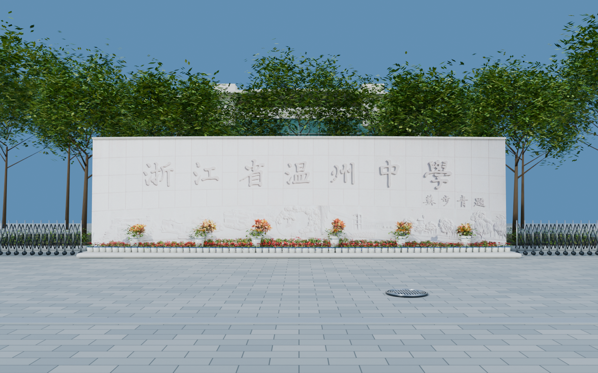

# 温州中学三维复刻项目

用户授权助手负责项目；先完成素材读取验收，再推进建模。

## 当前状态

全景图片读取验收已通过：95个点位、570个完整全景面、46,926张最高分辨率原始切片全部保存并解码，无缺片。
2个航拍点位每面5760×5760，其他93个点位每面4352×4352。

严格1:1所需的实际尺寸、标高与未拍摄区域仍须核验。
已开始创建南大门三维样板：校名墙、入口铺装、门禁、门卫房及绿化；全校园尚未建成。
目标已确认：可自由行走的写实校园，兼顾航拍与地面细节。
建议用Blender组织可编辑资产、UE实现漫游；最终工具组合与室内范围仍在讨论。
2026-09-06：Blender MCP场景读取和脚本执行通过，版本5.1.2；当前会话尚未发现UE MCP工具。

## 版本与交付

仓库：[cocomilk23/3D_WZMS](https://github.com/cocomilk23/3D_WZMS)。

- [阶段交付计划](docs/交付计划.md)
- [v0.0.1项目基线](deliverables/v0.0.1/交付说明.md)
- [v0.0.2南大门样板](deliverables/v0.0.2/交付说明.md)
- [v0.0.3网页预览](deliverables/v0.0.3/交付说明.md) · [本机打开](http://127.0.0.1:8766/)（需启动本地服务）
- [v0.0.4南大门广场](deliverables/v0.0.4/交付说明.md) · [当前Blender工程](models/campus/WZMS_Campus_v004.blend)
- [v0.0.5德涵楼、贯真楼外景](deliverables/v0.0.5/交付说明.md) · [楼体与广场工程](models/campus/WZMS_Campus_v005.blend)
- [Blender样板模型](models/south_gate/WZMS_SouthGate_v002.blend)（Git LFS，含打包的墙面参考图）

首版校名和浮雕采用原照片表面细节，尚非独立雕刻网格；尺寸仍为估算，尚未导入UE。

每个可检查工作单元提交并推送，阶段完成后建立标签。模型资产使用Git LFS。
**全量高清全景素材库仍保存在原工作机；新克隆需要另行获取素材包才能使用完整图库。南大门样板内已打包它所使用的一张墙面参考图。**

## 入口

- [素材图库](reference/素材浏览.html)：搜索95个点位，打开全分辨率参考面。
- [最新验收报告](reference/reports/素材验收报告.md)：本次读取结果与建模资料缺口。
- [逐点目录](reference/reports/scene_inventory.csv)：名称、分类、来源、哈希与状态。
- `reference/panoramas/tiles/`：原始切片ZIP。
- `reference/panoramas/faces/`：拼接参考面与各点位核验记录。
- `reference/source/`：原始页面、配置与用户截图。

## 后续工作

最新路线见[从南大门向北的制作顺序](docs/南北向制作顺序.md)。南大门广场初版已制作；接下来为德涵楼、贯真楼外景及中山路南段。每完成一个场景独立提交、推送并建立版本标签，不再更新网页预览。

1. 按建筑制作覆盖与细节清单，区分可见、有依据推断、完全未知区域。
2. 建立尺度和坐标依据，保留误差；视角角度不能充当测量坐标。
3. 先完成全校体量、道路、水系与运动场，再逐建筑细化。
4. 对应95个点位设置模型相机，对比轮廓、门窗、屋顶和材质。

原始全景：https://www.720yun.com/t/a3akiwphz2w?scene_id=119232347

## 核验脚本

运行 `scripts/verify_panoramas.py --sheets` 检查本地切片并生成预览。
运行 `scripts/build_reference_browser.py` 更新本地图库。
运行 `scripts/finalize_reference_audit.py` 在95个点位全部通过解码后更新报告。
初始清点脚本 `build_reference_inventory.py` 会重建早期状态；若重新运行，须再执行核验及最终报告脚本。
