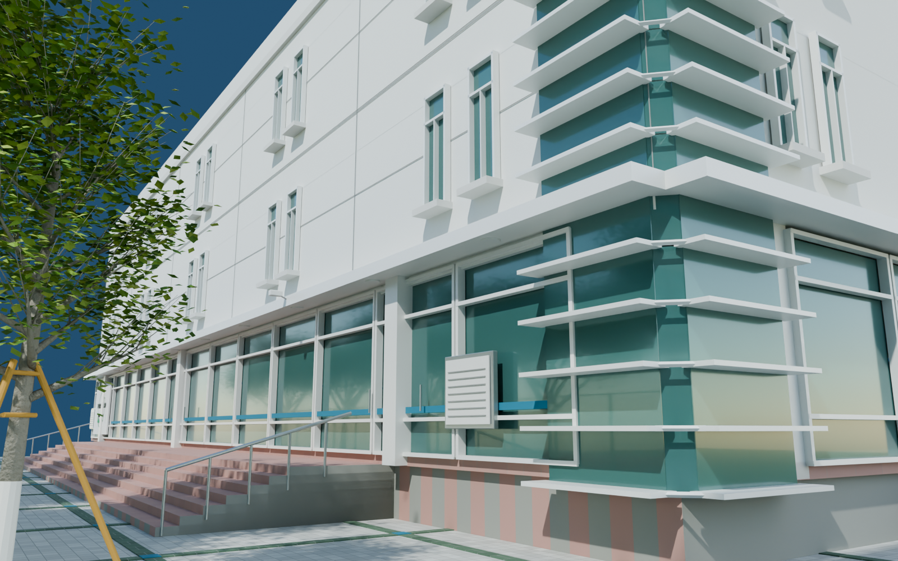
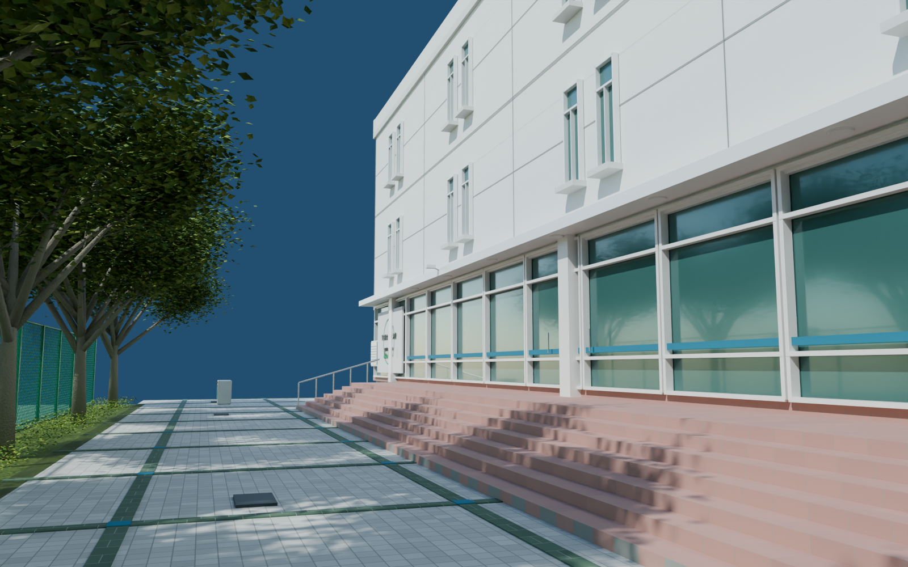
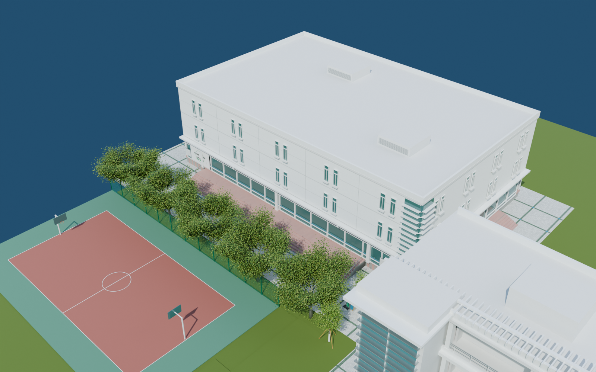

# v0.0.10 食堂外景

2026-09-06。可编辑外景初版，待用户验收。工程为 `models/campus/WZMS_Campus_v010.blend`，场景 `WZMS_Campus`，新增集合 70–78；包含此前所有路线场景。

## 制作内容

食堂按参考制作三层白色楼体，底层连续玻璃、白色窗框、蓝色安全腰线、门把手、雨檐和檐下灯；上部为成对窄窗、下部双扇窗框、外挑窗台及稀疏的立面分缝。转角另建折角玻璃和水平遮阳片，并在看图后补齐转角接缝。

前场有七级宽红石台阶、两侧扶手、绿色与白色小方砖网格、蓝色交点、排水口、分类垃圾箱、低矮绿篱、行道树，以及邻近球场的可见地面、围网、篮架和边线。食堂入口与 v0.0.9 的支路衔接。

墙面节粮主题标识包含立体文字和简化绿色图案。玻璃内只补了近窗桌椅与排队设施，以支持外部观察；完整食堂室内不在本版范围。公告小字、屋顶设备和未充分看到的背面为简化或推断部分。

## 检查与视角

- `33_Canteen_arrival`：从支路接近食堂，检查转角玻璃和立面。
- `34_Canteen_long_front`：沿食堂前场向北看。
- `35_Canteen_stair_detail`：宽台阶、门窗与雨檐细节。
- `36_Canteen_court_and_paving`：沿前场回看支路、围网和绿化。
- `37_Canteen_overview`：从西南上方查看食堂和邻近场地关系。
- `37b_Canteen_south_entry`：南侧打开的门扇、门框及台阶接续。

保存后重新打开渲染六张检查图；结果见 `render_validation.json`。地面检查增加了食堂连接支路、前场纵向行走线、两条宽台阶路线和南侧入口台阶。首轮发现南侧窗框挡住入口后，将该处改为独立门框与静态打开的门扇，并检查通过门口的地面；具体结果见 `geometry_validation.json`。南门背面校歌保留检查见 `preservation_validation.json`，文件体积、SHA-256 与最终看图记录见 `delivery_validation.json`。这些检查不代表用户验收或 UE 碰撞测试。

依据为 119232425 F、426 F 高清面及六面预览。楼长、进深、层高、位置和场地间距仍为图像估算，未测绘校准为严格 1:1；屋顶及服务背面只作外部体量衔接。后续北门从既有主路 x=54、y=360 接续。

