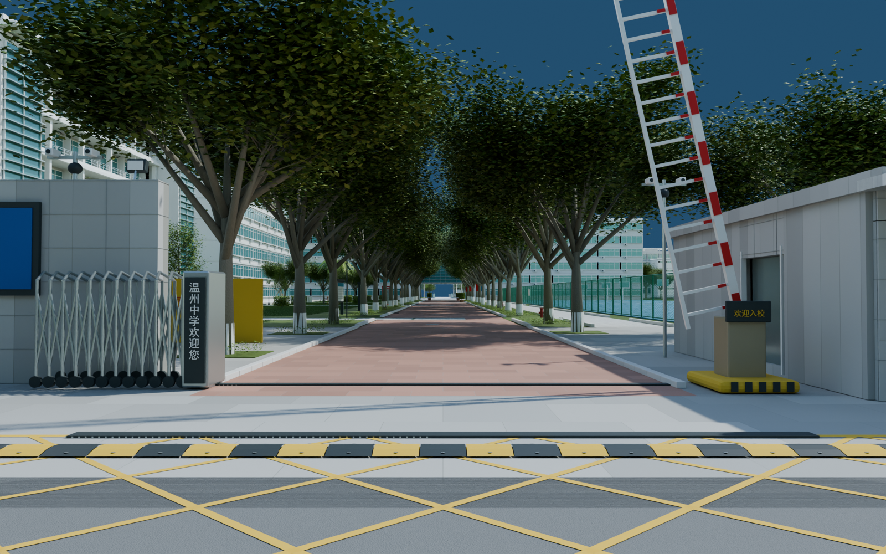
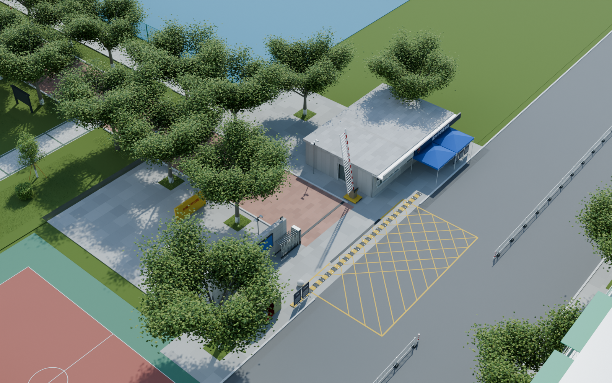
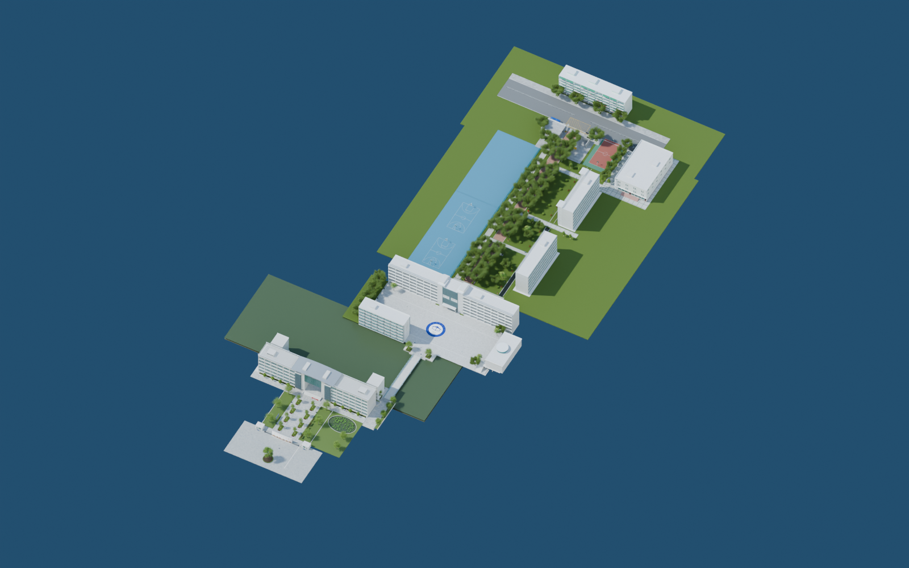

# v0.0.11 北门与南北路线整合

工程：`models/campus/WZMS_Campus_v011.blend`，场景 `WZMS_Campus`。本版接续中山路北端，新增集合 80–88，保留此前南大门至食堂的模型。本批次交付的是沿路线的可编辑外景初版，待用户验收；完整校园其他片区、建筑室内和 UE 漫游仍属后续工作。

## 北门内容

依照 119232351 F/R/B/L 高清面，制作低层灰石门卫房、警务室、石材分缝、白色窗框、窗帘和窗口近处办公家具。深色警务室匾额保留可见名称，门卫正面有温中路 16 号牌。小型警徽使用独立的立体图形近似，未宣称精确雕刻原徽。

门区包含灰石入口墙、收拢的伸缩门、交叉连杆、滑轮、电机箱、道闸及红白栅条、显示屏、摄像头杆和补光设备。道路接入中山路，有排水沟、黄线网格、减速带、花岗岩圆球、街边护栏与行道树。对面住宅按可见外立面补入五层住宅窗台、阳台栏杆、防护网、绿色雨棚、空调、底层卷帘和屋顶楼梯间，仅作门外环境，不包含住宅室内。

全景记录的是拍摄时现场，设备屏可见 2022-10-01。蓝色遮阳棚、绿色帐篷和防疫宣传板归入 `84_North_Historic_2022_Temporary_Furnishings_HIDEABLE`，可整组隐藏。临时展板仅保留可辨认标题和简化版式，未编造小字全文。

## 检查视角

- `38_North_gate_from_street`：从门外看入口、门卫和伸缩门。
- `39_North_guardroom_and_police`：警务室匾额、窗口与临时棚。
- `40_North_gate_from_campus`：从校内沿主路走向北门。
- `41_North_gate_street_context`：门外街道及对面住宅。
- `42_North_gate_overview`：北门、主路与周边的局部俯视。
- `43_Complete_route_overview`：本轮累计制作范围的整体俯视；地面以外和未细化片区不代表实景空地。
- `44_Buqing_to_north_integrated`：从步青广场回看向北延伸的整合路线。

## 使用与检查边界

道闸默认抬起，给沿主路的观察路线让出通道。选中 `North boom OPEN_POSE rotate Y to 0 for closed reference`，将 Y 旋转调为 0 可回到关闭姿态，调为 -78° 为当前开启姿态。它是可编辑的静态模型，不是已实现自动通行逻辑的 UE 设备。南门背面校歌按用户要求保留原状。

尺寸、标高、树间距及楼体位置仍为全景约束下的估算，尚未测绘校准为严格 1:1。车辆、行人和完整住宅室内未逐一复现；屋顶、隐蔽背面和地形边界含推断设计。

`render_validation.json` 记录保存工程重开后的检查图、贴图依赖和模型统计。`geometry_validation.json` 检查各场景实际地面及净高；`integrated_route_validation.json` 另沿南门到北门、主路到食堂的连续路线采样，并检查 0.70 米身体宽度和 1.70 米净高。它们是模型几何检查，不能代替 UE 角色碰撞和导航验证。`preservation_validation.json` 对比南门背面网格、UV、材质和打包原图；`delivery_validation.json` 记录文件哈希与看图情况。

本批次依次保留 v0.0.7 步青广场、v0.0.8 中山路中段、v0.0.9 中山路北段、v0.0.10 食堂、v0.0.11 北门，分别提交、推送并建立标签。不更新网页预览。

