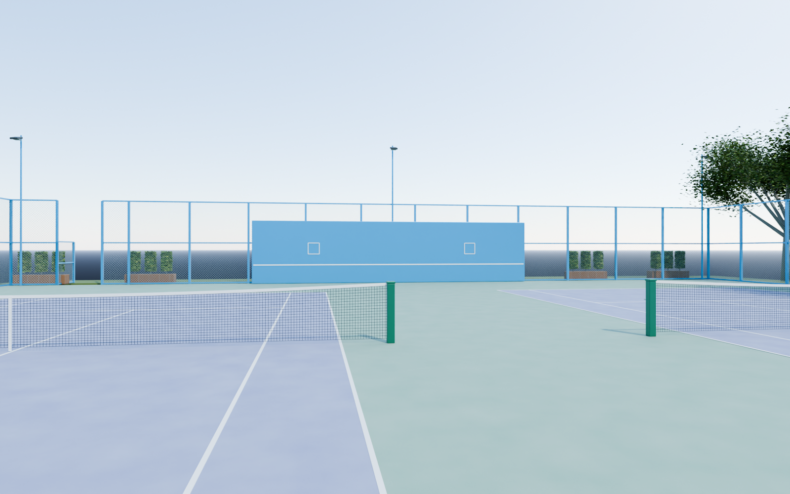
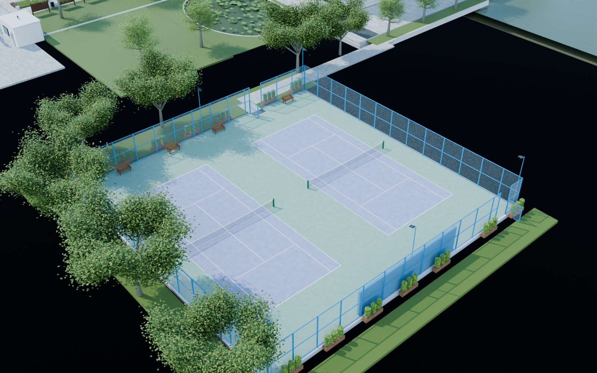

# v0.0.12 网球场

工程：`models/campus/WZMS_Campus_v012.blend`，场景 `WZMS_Campus`。集合 90–98 新增两个并排网球场，沿既有中山路南段接入，保留此前校园对象与 v011 本地改动。

包含淡紫色双打球区、绿色外围、单打/双打边线、发球线、中央标记、实际下垂网面、网柱和张紧手柄；蓝色框架与菱形金属围网、两处开启门、蓝色练习墙和两个白色目标框、六根照明杆、长凳及木花槽。表面采用打包在工程内的程序材质；新增自然日光天空。

检查相机：45 看练习墙；46 看球网及校园；47 看入口；48 看整体。`previews/` 保存 1600×1000 检查图。几何验证记录入口和球场退界路线的地面连续性、0.70 米身体宽度及 1.70 米净高；球网作为真实障碍保留，检查路线从网边绕行。

本版是可编辑外景初版，尚待用户验收。球场使用常见双打场比例作为局部尺度参考，整体位置和退界依旧为全景估算，不能视作严格 1:1 测绘结果。四周尚未制作的片区不代表现实空地；荷屿和水南路在后续版本接续。没有更新网页或完成 UE 漫游。

