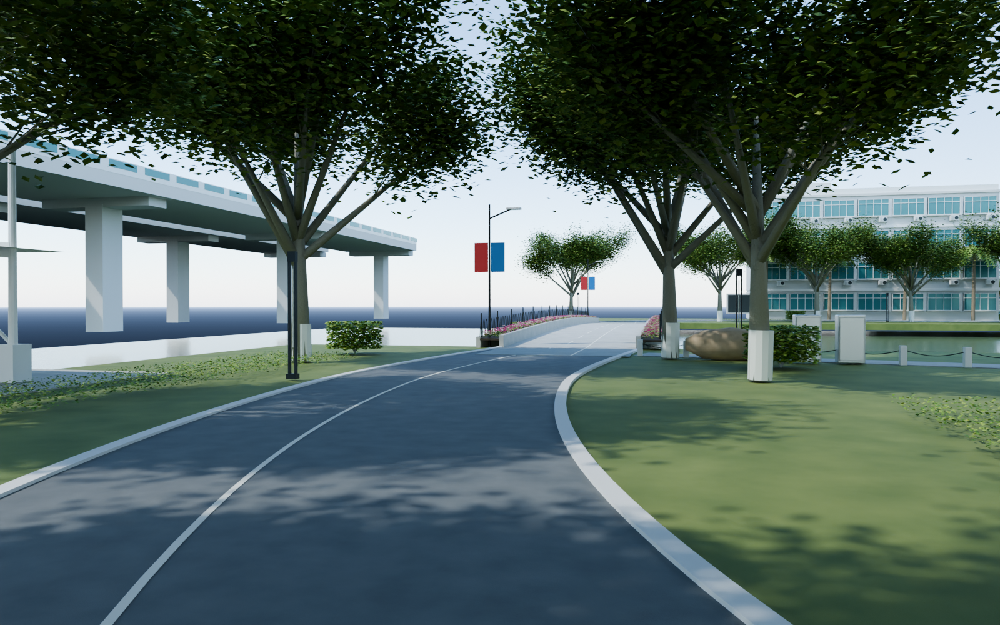
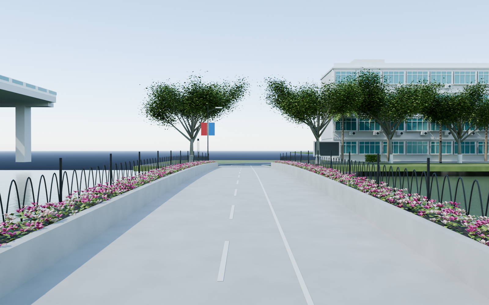

# v0.0.13 道司前路

工程：`models/campus/WZMS_Campus_v013.blend`，场景 `WZMS_Campus`。集合 100–108 覆盖全景 119232372–375 的道路外景：从南侧已有楼前道路向西绕行，经林荫弯道、花带桥，至靠近西门的道路交叉口。

包括弯曲沥青路、白色引导线、树干涂白、地被和细长景观灯；白色停车棚具有独立立柱、斜撑、拉杆和微曲屋面。桥面有轻微起伏、实际桥墩、砖铺桥头、两侧连续花槽、粉白色花朵和黑色尖拱栏杆。补入滨水支路、石柱链条、景石、设备箱、路灯和井盖。

高架桥、四层楼侧界面、棕榈和室外显示屏仅作为该路可见环境，置于 `105_Daosi_Visible_Context_ESTIMATED`。西门建筑、完整运动场及南田路仍待独立制作，已预留道路接头。车辆、人物和临时施工机械未逐一复制。

相机 49 为林荫弯道，50 为花带桥，51 看对岸教学楼，52 看北端交叉口，53 为俯视。检查图与保存后重开验证记录在本目录。延续网球场版本和此前主线场景；尺寸为图像估算，待用户验收，尚未做严格 1:1 校准及 UE 漫游。

