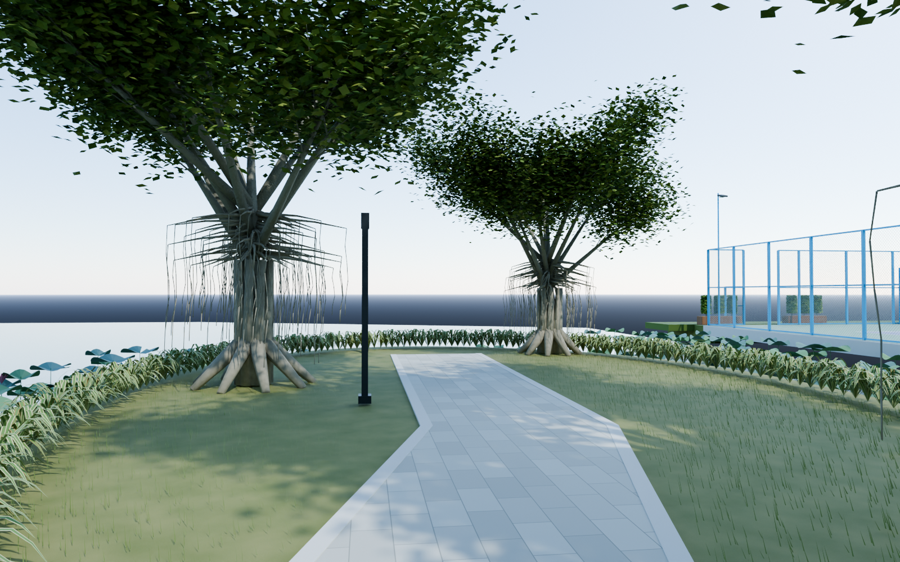
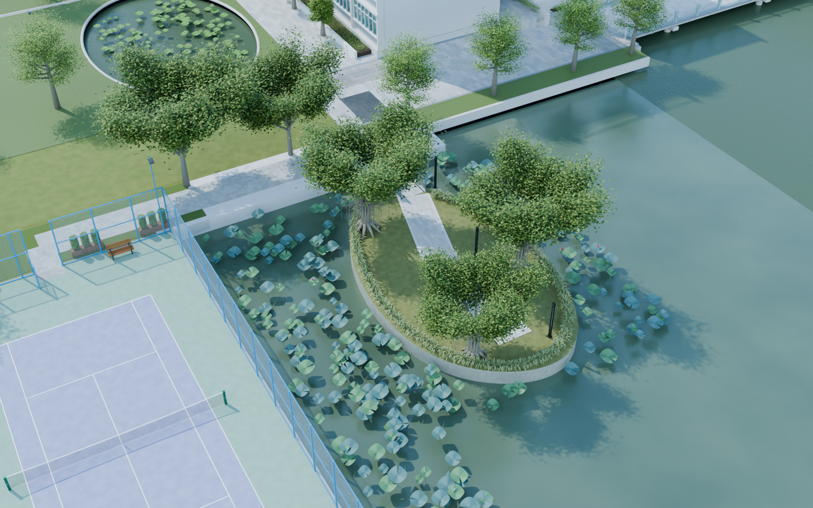

# v0.0.14 荷屿

工程：`models/campus/WZMS_Campus_v014.blend`，场景 `WZMS_Campus`。集合 110–118 新增狭长草地岛、封闭岸体、与已有水面衔接的湖面、石板路和通向中山路一侧的入口步桥。

依照全景 119232364、365，制作榕树多干、板根和垂挂气根；岸边斑叶植物具有弯曲叶片与浅色叶缘；荷叶、叶柄、零星花瓣和部分枯叶为独立网格。步桥有透明玻璃栏板、灰色扶手、夹具螺栓、排水沟及实际支撑。包含细长景观灯、摄像头和救生圈，并补齐此前预留的球场周边陆地。

相机 54 沿岛上石板路看榕树，55 回看入口桥与校园，56 看荷叶及球场，57 为岛屿俯视。水南路东侧折线桥在下一版接续；本版保留其连接端。

这是可编辑外景初版。岛形、树形、植物数量、水位和间距为全景约束下的近似，尚非测绘级 1:1。程序材质随工程保存，不需要另找外部贴图；真实比例校准、用户验收和 UE 漫游仍未完成。

