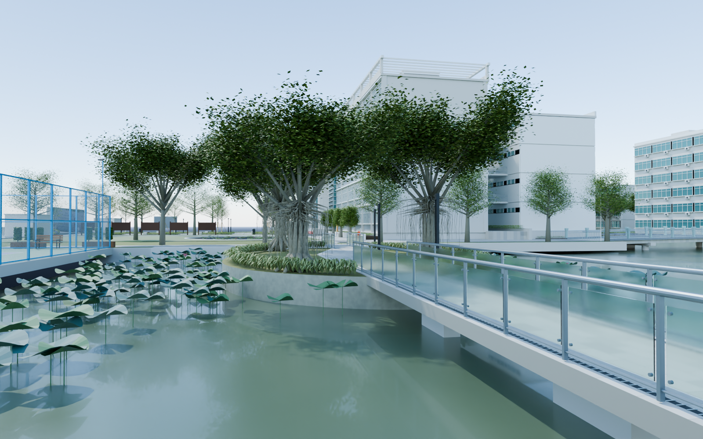

# v0.0.15 水南路与南侧四场景整合

工程：`models/campus/WZMS_Campus_v015.blend`，场景 `WZMS_Campus`。集合 120–128 新增从荷屿东端沿水面折返至球场一侧的连续步桥、岸边小块陆地和灰色小型设施房。

桥上石板铺装、两侧排水沟、灰色圆扶手、透明玻璃、独立夹具和桥墩均为可编辑构件。陆地段转为竖杆栏杆，配有草坡、榕树、带竹支撑的小树、景观灯和岸石。灰色设施房有分缝、蓝色门、铝框、把手及高位通风口；未把未知室内虚构为真实校内功能空间。

为接通荷屿东端，在本版中局部裁去两组既有植被网格侵入新桥面的叶片；v0.0.14 历史工程不改动。保留情况报告单独列出这两项连接调整，并核对剩余叶片与其他既有物体不变。折线步桥采用等宽转角，避免内侧栏杆挤占路线。

步桥末段落在岸地后不再横设玻璃栏杆，向小房门前的支路保持开放；通行检查包括这条支路，设施房本身仍为关闭的外景建筑。

相机 58 回看荷屿，59 看球场侧陆地与小房，60 看球场及荷塘，61 为步桥俯视，62 为本轮四场景连同南侧既有建筑的整合视图。

本轮逐场景保留 v0.0.12 网球场、v0.0.13 道司前路、v0.0.14 荷屿、v0.0.15 水南路；每版有独立工程、检查图、几何及保留情况报告，并分别提交、推送和建立 Git 标签。未更新网页预览。

全部为待用户验收的外景初版。道路和岛屿位置仍为照片估算；未建区不代表实景空地，严格 1:1 校准及 UE 碰撞、导航、运行性能验收属于后续工作。几何报告只记录所列路线的采样检查，不代表校园任意位置均可通行。

