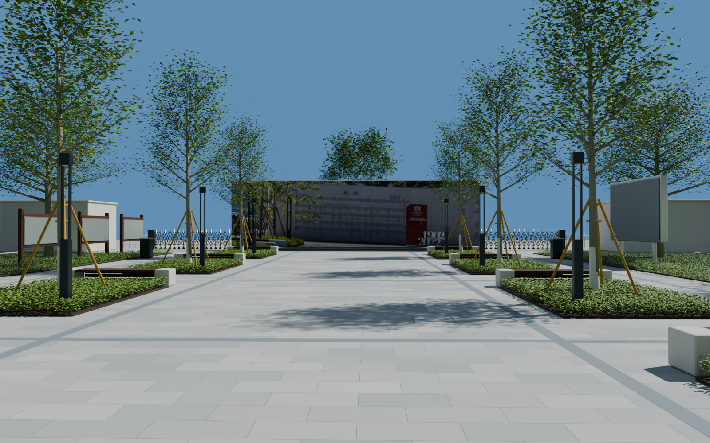
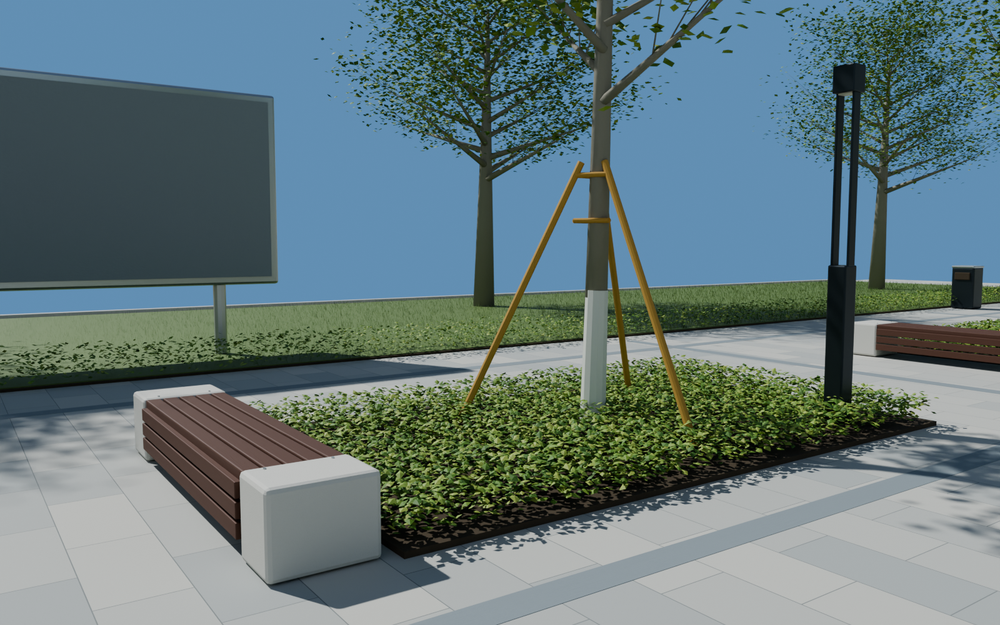
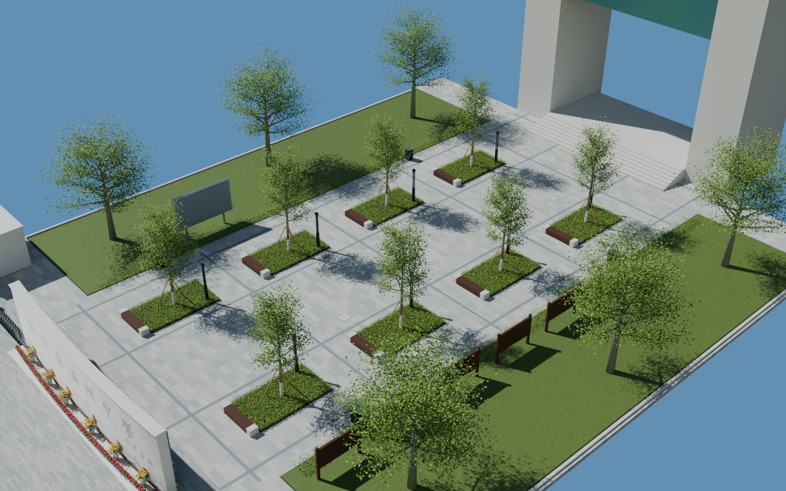

# v0.0.4 南大门广场

2026-09-06。已制作初版外景，待用户验收；不是全校建成或实测 1:1 验收结论。

## 打开与检查

- 可编辑工程：`models/campus/WZMS_Campus_v004.blend`。包含原南大门及向校内延伸的广场，模型单位为米。
- 场景：`WZMS_Campus`。新增集合编号 10–18；编号 19 明确是下一阶段待替换的楼体门洞占位。
- 已存相机：`06_Plaza_toward_gate` 反向看南门、`07_Plaza_bench_detail` 家具与树池、`08_Plaza_overview` 总体；`05_Plaza_from_gate` 可查看向楼体方向。
- 不再制作网页。直接打开 Blender 工程，可从上述相机或自由视角检查。

## 本版内容

校名墙后方的铺装、纵横石材分带、八处狭长树池、乔木竹支撑、石端木座椅、庭院灯、宣传栏框架、显示牌背面、垃圾桶、草坪、地被和外侧乔木。井盖及铺装分带已调整至接近齐平。原南门估算后排树带与实体背景楼已移除，广场主轴保持通畅。

校名墙背面增加原始 119232353 全景的照片投影；使用的正反面照片均打包在工程里。植物枝干和叶片是网格，家具与铺装可独立编辑。

## 检查证据

- 从保存的工程重新打开，以 Cycles / RTX 3060 OptiX 渲染三张 1600×1000 检查图，检查布局、树池、座椅、墙背及整体接续。
- 缺失外部图片：0。详见 `render_validation.json`。
- 从实际求值网格检查广场主路和左右横向通道：地面连续、采样处 1.7 米净高未被阻挡；详见 `geometry_validation.json`。这不等同于 UE 碰撞测试。
- 文件大小和 SHA-256 见 `delivery_validation.json`。

## 已知限制

尺寸、树高、植物形态和树池间距按图像估算；尚未获得测绘校准。植物为程序化初版，仍可按后续全校统一植被资产深化。宣传栏小字未辨认，不编造正文。墙面照片含植被遮挡和透视残留，浮雕尚未雕刻为独立网格。

本版楼前只保留门洞占位以说明下一片区位置；完整外墙、窗带、楼梯间、屋顶与沿湖界面在下一场景制作。未拍摄的地下构造、内部房间以及未完成的相邻校园部分不作为本版已复原内容。

