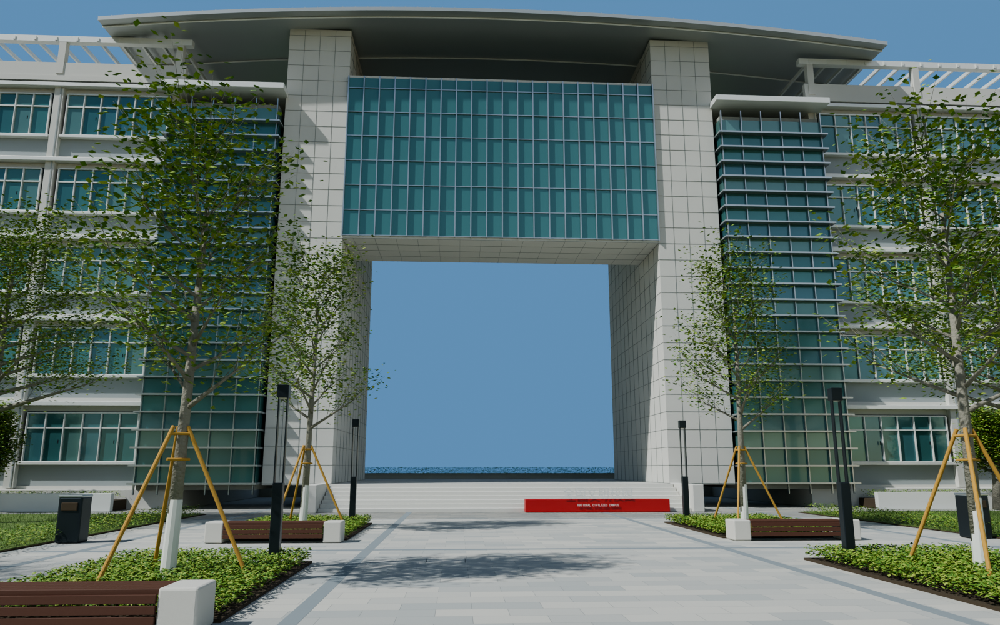
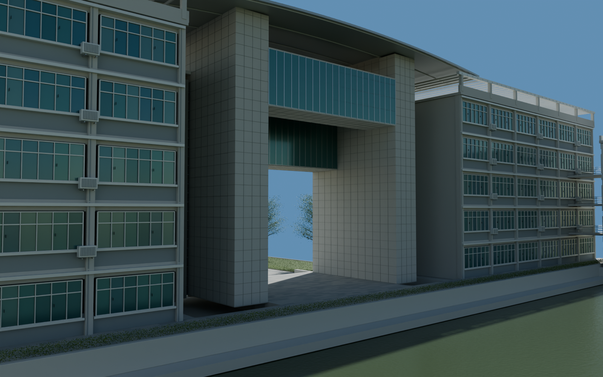
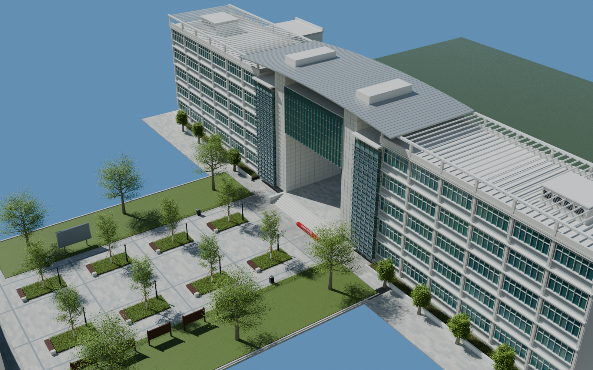

# v0.0.5 德涵楼、贯真楼外景

2026-09-06。初版外景资产，待用户验收。继承 v0.0.4 的南门与广场；本版替换楼体占位，保留统一局部坐标。

## 工程

`models/campus/WZMS_Campus_v005.blend`，场景 `WZMS_Campus`。新增集合编号 20–28，包含基础、五层两翼、门洞石柱、玻璃楼梯间、架空连桥、弧形屋顶、外墙细部、沿湖步道及相机。

直接使用相机 `09_Portal_from_plaza`、`10_Portal_underside`、`11_Building_lakeside`、`12_Building_overview`、`13_Honour_sign_detail` 检查正面、仰视、背面、屋顶和标识。文字已转为实体网格，打开工程不依赖本机字体。

## 本版制作

- 两侧五层外墙的窗带、白色窗框、窗扇、把手、窗台、竖向构件、层间腰线；内部只保留支撑外景所需的空楼板和隔断。
- 巨大门洞及其可穿行平台、七级台阶、石材分缝；上部两道不同底标高的玻璃连桥、幕墙分格和檐底。
- 两侧青绿色玻璃楼梯间及水平遮阳构件、轻弧形金属挑檐、屋顶构架和设备间。
- 后端小体量及开敞连廊、可见形式的空调外机、落水管、楼前绿带和“全国文明校园”立体字。
- 背面沿湖步道、低花池、嵌入式灯具与局部真实水面。

## 自检

从保存的工程重新打开并渲染五个视角；图片依赖、几何统计和设备见 `render_validation.json`。从实际求值网格检查广场、台阶、门洞至沿湖步道的地面和净高，见 `geometry_validation.json`。工程哈希见 `delivery_validation.json`。

检查过程中补齐了平台至沿湖步道的地面，并将台阶改成向平台下方连续搭接的实体，避免倒角接缝成为穿透至底层的空隙。石材噪声改用以米为单位的坐标，修正长条构件上的拉伸纹理。

## 依据与限制

正面与门洞主要依据 119232352、353、354；侧面与窗带参考 366；体量关系参考航拍 348。建筑总宽约 98 米、主体五层、中央屋顶约 24 米、门洞净宽约 15 米，均为图像估算，尚未进行测绘校准。

后端体量深度、内部隔断、被遮挡的门窗和设备数量是按可见规则补充的近似；照片未覆盖的室内不称为复原完成。植被仍是程序化初版，玻璃室内层次和材料微观细节可继续深化。湖对岸建筑不属于本场景；下一阶段制作中山路南段及跨水桥。

本版不包含 UE 导入、运行时碰撞或漫游性能验收。

