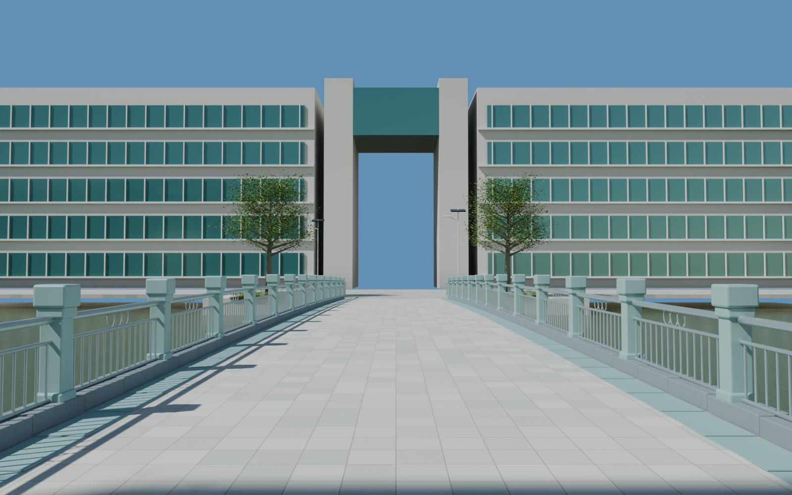
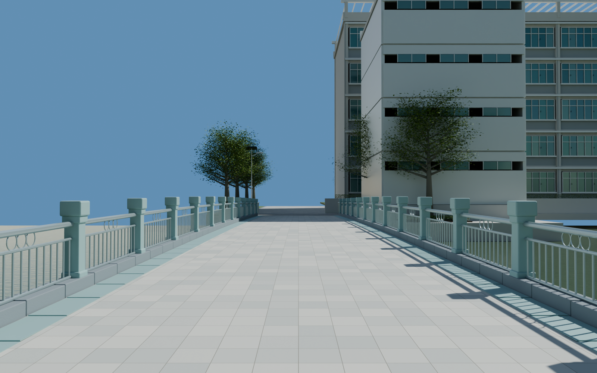
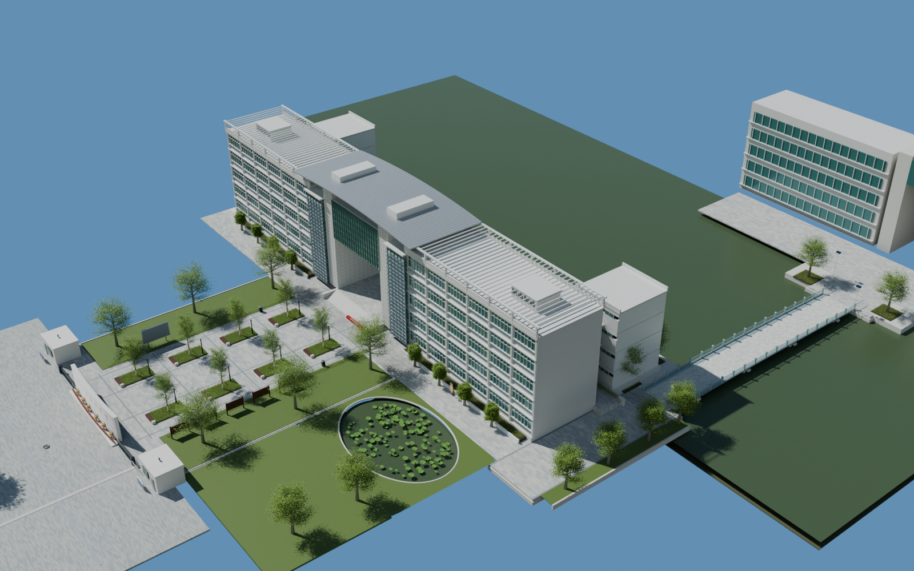

# v0.0.6 中山路南段与跨水步行桥

2026-09-06。本轮第三个场景初版，待用户验收。工程同时包含南门、广场、德涵楼与贯真楼外景及本次道路、桥梁。

## 打开

`models/campus/WZMS_Campus_v006.blend`，场景 `WZMS_Campus`。新增集合编号 30–38。相机：

- `14_Zhongshan_wayfinding`：路牌、题名石与楼侧道路。
- `15_Zhongshan_bridge_north`：沿桥向步青广场。
- `16_Zhongshan_bridge_south`：沿桥回望南侧。
- `17_Three_scenes_overview`：本轮三个场景与南门的整体关系。

编号 39 的集合明确为下一阶段步青广场的背景占位，不能把它计作第四个已完成场景。此前各版相机仍在，可随时返回南门、广场和楼体检查。

## 本版内容

广场北缘沿楼前转向东侧，再沿楼端接上跨水步行桥。包含道路铺装、井盖、路牌与题名石、绿带、树木、太阳能路灯、局部荷塘、岸线及桥头地形。

桥为真实立体网格：约 50 米长、6.8 米宽，浅拱桥面最高约 0.30 米；桥面小方砖、边缘绿砖、灰石栏座、浅蓝灰方柱、银灰色圆管、细立杆和三圆环装饰分别建模，另有梁、桥墩与桥头栏杆延伸。桥面不是全景投影。

为了接通楼前横向道路，本版裁去了旧广场绿带北端伸入道路的叶片、草和土基；没有只用新铺装盖住旧绿化。

## 自检

从保存工程重新打开，渲染四个视角；详见 `render_validation.json`。检查原广场、门洞平台、楼前横路、东侧转弯和整个桥面上的实际求值地面与 1.7 米净高；详见 `geometry_validation.json`。这项检查覆盖三个场景接续，但不是 UE 运行时导航或碰撞验证。

工程内打包南门所用的正反面原图及中山路牌的原始参考图；图片依赖核验见渲染记录。文件大小与 SHA-256 见 `delivery_validation.json`。不新增网页预览。

## 边界与下一步

依据为 119232366、367，辅以 353 和航拍 348。桥长、桥宽、起拱、路口位置、岸线和设备间距均按图像估算，尚未达到测绘校准的严格 1:1 精度。桥栏杆装饰为网格；路牌印刷面采用 366/f 的原图投影，保留竖排标题、校徽和导向图，仍有原图透视及光照残留；荷塘仅是入口附近的局部环境，整座荷屿不计作完成。

北端接续位置暂定局部坐标 x=54、y=134、z=-0.01，下一阶段由步青广场接入。背景占位的建筑、校园其他道路与完整湖岸仍按后续场景逐一替换和补齐。植被、材质与内部空间仍有深化空间；当前交付为可编辑外景初版，不是全校园写实终版或 UE 漫游成品。

