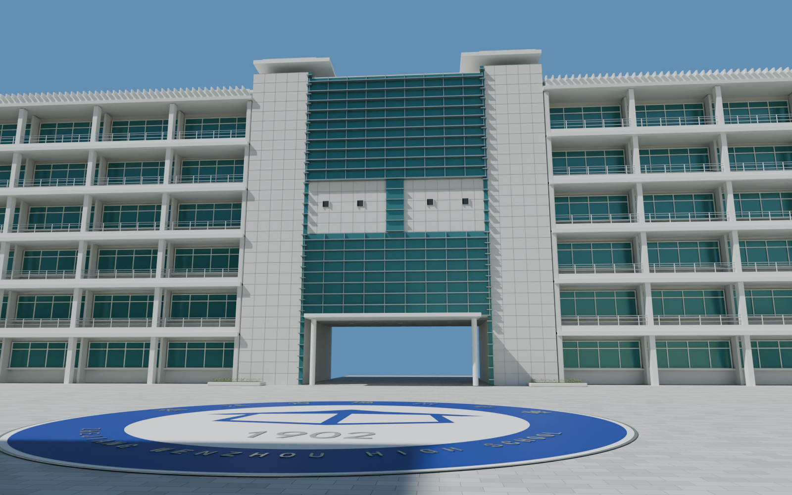
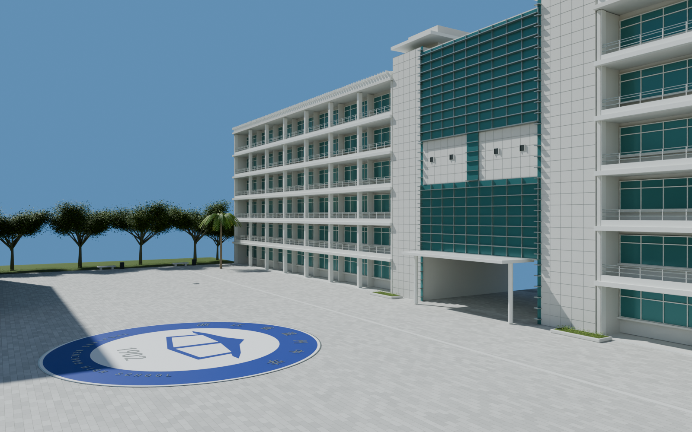
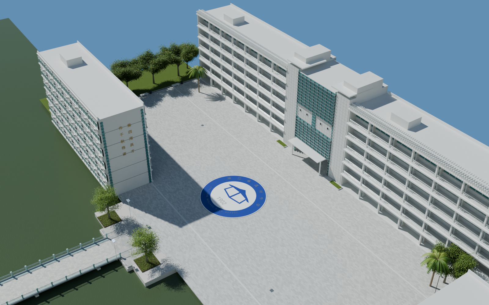

# v0.0.7 步青广场

2026-09-06。可编辑外景初版，待用户验收。工程整合此前南门、内广场、德涵楼及贯真楼外景、中山路南段与跨水桥。

## 打开与检查

打开 `models/campus/WZMS_Campus_v007.blend`，场景 `WZMS_Campus`。新增集合编号 40–48；删除了 v0.0.6 中编号 39 的北端临时背景。

- `18_Buqing_arrival`：从桥头走入广场，面向教学楼入口。
- `19_Buqing_crest_and_galleries`：校徽铺地与两侧敞廊。
- `20_Buqing_library`：广场侧面的图书馆入口界面。
- `21_Buqing_overview`：广场及与已有南侧场景的连接。
- `22_Buqing_portal_passage`：门厅穿行与北侧出口。

## 本版内容

大面积错缝灰石铺装、排水沟与井盖、蓝白校徽拼花、六层敞廊教学楼、窗框及阳台栏杆、屋顶遮阳格栅、中央石材门厅与上下两段青绿色玻璃幕墙、玻璃水平遮阳片、入口圆柱和雨棚均为可编辑几何与程序材质。

补充了南侧教学楼的可见窗带、空调外机和楼端玻璃竖带；图书馆的可见入口、外台阶、屋顶圆形采光体和展示板构成广场另一侧边界。图书馆未拍摄的内部、完整侧后立面仍属于之后的建筑深化范围。

地面校徽由独立圆环、图案与文字网格重建，避免使用整张透视照片覆盖地面。原图中的文字字形、笔画和图案比例仍为手工重建近似，不能当成学校官方矢量标志文件。

## 依据与边界

主要依据为 119232355 的 F/B/L/R/D 全分辨率照片，367 用于桥头关系，368 用于北侧出口衔接。观察确认的是六层敞廊、门厅上下玻璃与中部石材分段、蓝白圆形校徽、图书馆入口和植被边界；广场长宽、楼深、层高、桥头退距和地形坐标为图像估算。局部轴线沿用既有工程，不代表经过测绘的正北坐标。

牌匾和活动展板只重建可辨认主文字与结构，细小印刷内容未逐字复刻。树冠、侧后方遮挡部分和座椅位置为参考约束下的补充设计。尚非严格测绘 1:1 或整个校园的写实终版。

用户指出的南大门背面校歌问题本版保留，未在本轮修复。每个后续场景继续独立保存、提交、推送和建立标签。不更新网页预览；UE 漫游与碰撞仍未开始。

## 自检记录

重新打开保存工程后渲染上述五个视角；数据见 `render_validation.json`。实际地面连续性、台阶与 1.7 米净高检查见 `geometry_validation.json`，覆盖旧南侧路线及桥头—广场—门厅—北侧出口、广场横向道路和图书馆外台阶。这不是 UE 运行时碰撞检测。工程文件 SHA-256 和人工看图结论见 `delivery_validation.json`。

北侧接续端暂定为局部坐标 x=54、y=205、z=-0.01，下一版延伸中山路中段。

