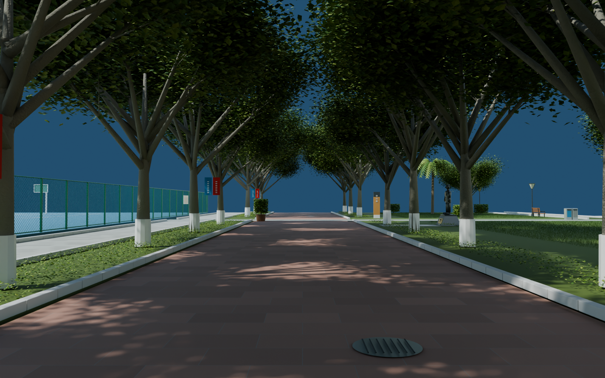
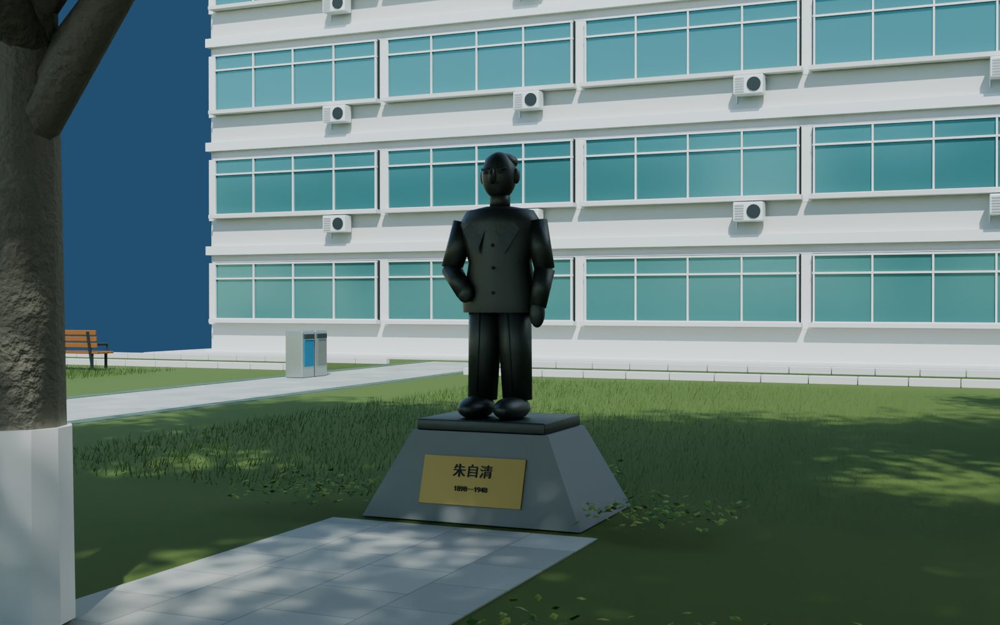
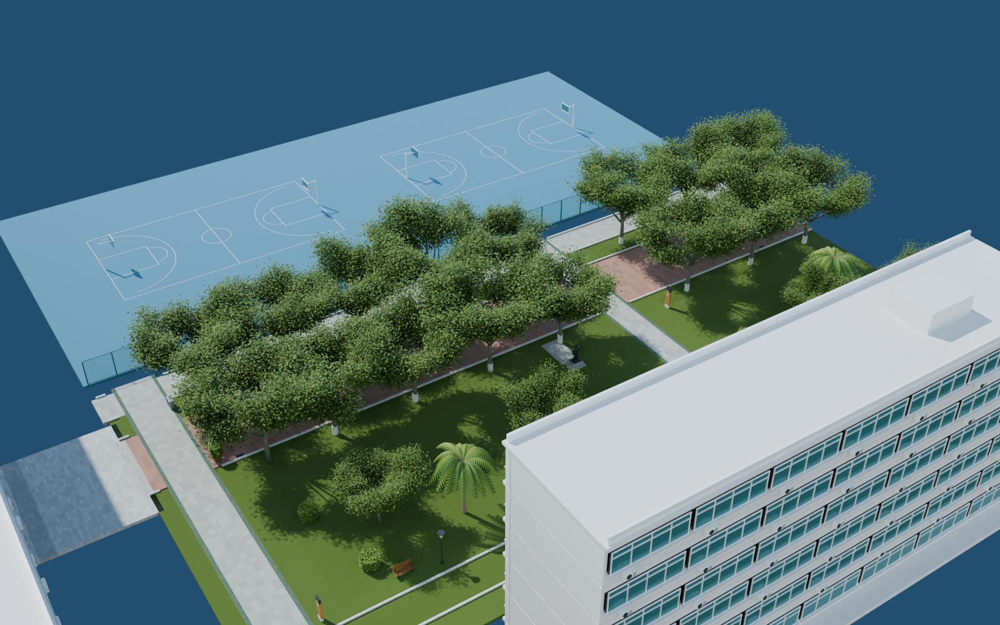

# v0.0.8 中山路中段

2026-09-06。向北延伸的可编辑外景初版，待用户验收。打开 `models/campus/WZMS_Campus_v008.blend`，场景 `WZMS_Campus`。包含此前全部交付；新增集合 50–58。

## 观察视角

- `23_Middle_avenue_north`：沿红色中山路进入连续树荫。
- `24_Jiangkou_junction`：侧向支路、草坪、路旁楼体与家具。
- `25_Zhu_Ziqing_garden`：雕像、底座、铭牌和接近小路。
- `26_Middle_avenue_overview`：道路、绿地、楼体及运动场边界关系。
- `27_Middle_court_edge`：绿色围网、花盆、树池和路口铺装。

## 本版内容

沿既有步青广场北出口向局部 +Y 方向延伸约 85 米，红石主路宽约 8.6 米。包含两排成熟树冠、白色树干基部、麦冬式低矮地被、草坪和灌木、棕榈、侧向灰石路、路缘石、雨水口与井盖。

新增沿街六层窗带楼体，窗框、空调外机、楼板和屋顶分别建模；绿色菱形围网使用真实细线网格，补入临近运动场的可见地面、球场线和篮球架。完整运动场设施、其他边界及楼内空间留待对应片区深化。

朱自清像采用独立立体雕塑网格，包含站姿、西装、双腿、双臂、头部和底座。铭牌姓名与年份可编辑；这仍是照片约束下的形态近似，脸部、衣褶和原雕塑表面细节尚未达到精细肖像雕塑程度。没有用人物照片平板替代雕像。

路灯、座椅、花盆、双桶垃圾箱、路名牌和简化树上活动条幅为独立物件。条幅、围栏宣传板的细小印刷文字未逐字还原。

## 检查与边界

依据为 119232368 的 F/B/L/R 高清面、369/R 及各自预览。道路长度、庭院宽度、树木间距及楼体位置均为图像估算，未测绘校准为严格 1:1。场景以外的天空空白表示尚未制作的区域，不能理解为现实校园没有其他建筑。

树荫视角自检后提高了整合工程的漫射天空补光，保留原有直射太阳；因此此前场景在本版打开时也会使用这套较明亮的环境光。南门背面校歌的网格、UV、材质及贴图内容没有修改，与 v0.0.6 的内容对比见 `preservation_validation.json`。

从保存工程重新打开渲染五个相机；见 `render_validation.json`。旧路线之外，另检查主路三条平行行走线、侧向交会、绿地侧路及雕像接近小路的真实地面和净高；见 `geometry_validation.json`。检查中发现伸入雕像小路的地被，已在建模时分段让出通道。自检不等同于用户验收或 UE 运行时碰撞测试。

文件体积、SHA-256 与人工看图记录见 `delivery_validation.json`。后续由 x=54、y=290 接续中山路北段。本版继续按独立 commit、push、tag 交付，不更新网页预览。

