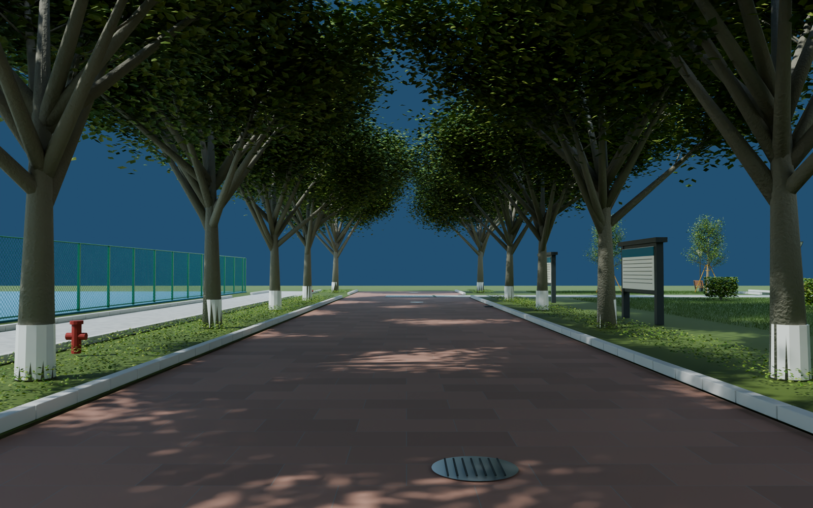
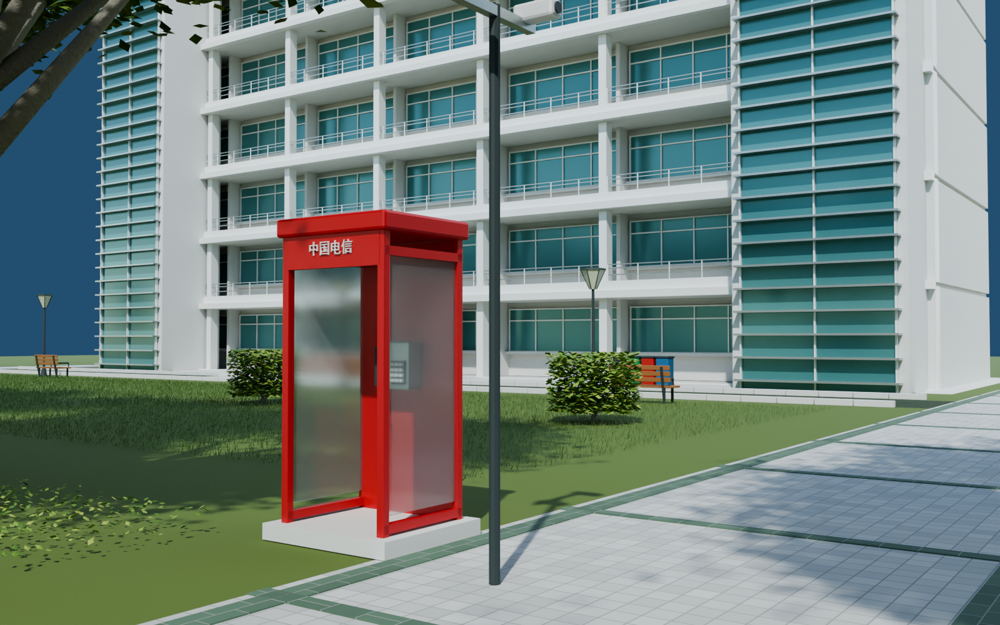
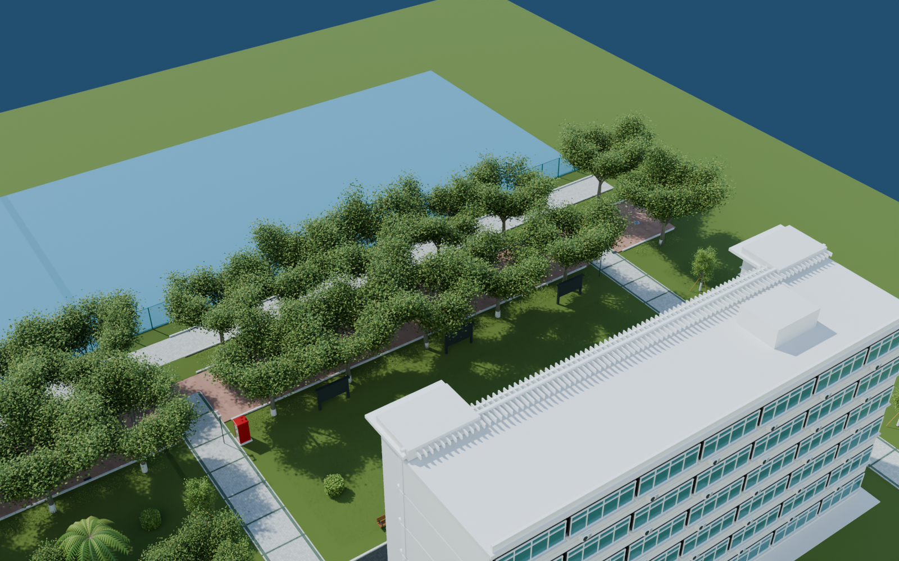

# v0.0.9 中山路北段

2026-09-06。可编辑外景初版，待用户验收。打开 `models/campus/WZMS_Campus_v009.blend`，场景 `WZMS_Campus`；本版包含此前场景，新增集合 60–68。

## 本版内容

从中段 y=290 接续至 y=360，包含红石主路、两排行道树、树干白涂层、草坪和低矮地被、路缘、雨水口、井盖，以及竹屿方向和食堂方向的白色小方砖支路。补入六层沿线楼体、两端竖向玻璃与水平遮阳片、入口红石台阶、门框和雨檐。

红色电信电话亭含独立框架、玻璃、电话机、按键、听筒及线；沿路有宣传栏、长椅、路灯、消火栓、分类垃圾箱和双摄像头杆。运动场目前仅补沿路可见场地边界和围网，完整场内设施后续制作。

## 检查视角

- `28_North_avenue`：向北行走的主路及树荫。
- `29_Telephone_and_bamboo_lane`：电话亭与楼间支路。
- `30_North_entry_and_noticeboards`：建筑立面和入口台阶。
- `31_Canteen_branch`：食堂支路铺地和幼树支撑。
- `32_North_route_overview`：主路、楼体、草地与运动场的局部关系。

已从保存工程重新打开、渲染并查看以上五张图。自检修复了远端幼树下的地面支撑，并补入标为 `CONTEXT_ESTIMATED` 的邻近基础地形，避免把暂未细化的地面表现成悬空；这不是测绘地形。电话亭内部物件可透过玻璃辨认，玻璃反射、树叶形态和表面风化仍可继续精修。

几何检查覆盖先前路线，以及北段三条平行行走线、两条横向支路、绿地侧路和建筑入口台阶；实际地面与净高检查通过。它不等同于 UE 运行时碰撞和用户验收。南门背面校歌网格、UV、材质和打包原图与 v0.0.6 内容一致，未调整。

## 依据和后续

依据 119232370 F/L、371 R 高清面及六面预览。建筑长度、层高、路宽、绿地和楼体位置为图像估算，尚未测绘校准至严格 1:1。公告的小字为版式近似，未编造全文。下一场景从 x=107.5、y=348 接入食堂，主路 x=54、y=360 预留北门连接。

保存文件体积、SHA-256、看图记录见 `delivery_validation.json`；渲染、地面及校歌保留检查分别见本目录三个验证报告。每场景独立提交、推送、建立版本标签，不更新网页。

